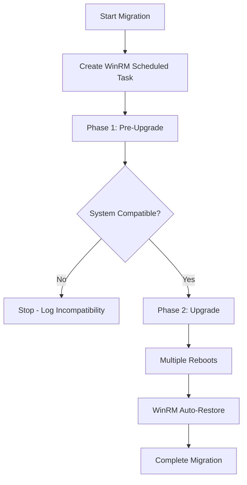

## Migration Architecture

The Windows 10 to 11 migration tool uses a **two-phase approach** orchestrated through Ansible playbooks. This design ensures a safe, reliable upgrade process with built-in recovery mechanisms.

<Steps>
  <Step title="Phase 1: Pre-Upgrade">
    Validates system compatibility, creates restore points, and ensures the system is fully patched before attempting the upgrade.
  </Step>
  <Step title="Phase 2: Upgrade">
    Executes the actual Windows 11 upgrade using either ISO-based installation or registry-based Windows Update method.
  </Step>
</Steps>

## Main Playbook Structure

The migration is controlled by the main playbook `migra_w10_to_w11.yml`:

```yaml
---
- name: Migracion SO Windows 10 a 11
  hosts: all
  gather_facts: true

  pre_tasks:
    - name: Crear Tarea Programada para recuperar Script WinRM
      community.windows.win_scheduled_task:
        name: "WinRM Setup"
        description: "Restaurar Configuración de WinRM"
        actions:
          - path: "powershell.exe"
            arguments: "-NoProfile -ExecutionPolicy Bypass -File C:/temp/ansible/PS/WinRM.ps1"
        triggers:
          - type: boot
        state: present
        enabled: true
        user: "SYSTEM"
        logon_type: service_account

  tasks:
    - name: FASE 1 - PRE-UPGRADE
      block:
        - name: 1 - Validación y Ejecución de Requisitos
          ansible.builtin.include_role:
            name: fase_1

    - name: FASE 2 - UPGRADE
      when:
        - not compatible # -- OJO -- Valor REAL: compatible
        - ansible_distribution == "Microsoft Windows 10 Pro"
      block:
        - name: 2 - Proceso de Upgrade
          ansible.builtin.include_role:
            name: fase_2
            tasks_from: regedit_main.yml
```

## WinRM Scheduled Task Setup

<Note>
  **Critical for maintaining connectivity during migration**
</Note>

Before any migration tasks run, the playbook creates a scheduled task that automatically restores WinRM configuration after system reboots. This is essential because:

- The Windows 11 upgrade process involves multiple reboots
- WinRM settings may be reset during the upgrade
- Ansible requires WinRM to communicate with Windows hosts
- The scheduled task runs at boot as the SYSTEM account to reconfigure WinRM

### How It Works

<Steps>
  <Step title="Task Creation">
    A scheduled task named "WinRM Setup" is created on the target system during the `pre_tasks` phase.
  </Step>
  <Step title="Boot Trigger">
    The task is configured to trigger automatically at system boot (`type: boot`).
  </Step>
  <Step title="Script Execution">
    It executes the PowerShell script `C:/temp/ansible/PS/WinRM.ps1` with bypass execution policy.
  </Step>
  <Step title="Privilege Escalation">
    Runs as SYSTEM account (`user: "SYSTEM"`) with service account logon type for required privileges.
  </Step>
</Steps>

### Task Configuration

| Parameter | Value | Purpose |
|-----------|-------|----------|
| **Name** | WinRM Setup | Task identifier |
| **User** | SYSTEM | Runs with highest privileges |
| **Trigger** | Boot | Executes on every system startup |
| **Script** | C:/temp/ansible/PS/WinRM.ps1 | WinRM configuration script |
| **Execution Policy** | Bypass | Allows unsigned script execution |

<Warning>
  Without this scheduled task, Ansible connectivity may be lost after the upgrade, requiring manual intervention to restore WinRM on each target system.
</Warning>

## Phase Execution Flow



## Phase Gating

Phase 2 only executes when specific conditions are met:

<CodeGroup>
```yaml Compatibility Check
when:
  - not compatible # Note: In production, use 'compatible'
  - ansible_distribution == "Microsoft Windows 10 Pro"
```
</CodeGroup>

<Accordion title="Understanding the compatibility variable">
  The `compatible` variable is set during Phase 1 after running the WhyNotWin11 compatibility check. It evaluates 11 different hardware and software requirements:
  
  - Architecture (64-bit)
  - Boot Method (UEFI)
  - CPU Compatibility
  - CPU Core Count
  - CPU Frequency
  - DirectX + WDDM2
  - Disk Partition Type (GPT)
  - RAM Installed
  - Secure Boot
  - Storage Available
  - TPM Version 2.0
</Accordion>

## Next Steps

<CardGroup cols={2}>
  <Card title="Phase 1: Pre-Upgrade" icon="clipboard-check" href="/phases/phase-1">
    Learn about OS validation, compatibility checks, and system preparation
  </Card>
  <Card title="Phase 2: Upgrade" icon="upload" href="/phases/phase-2">
    Understand the upgrade process using ISO or registry-based methods
  </Card>
</CardGroup>