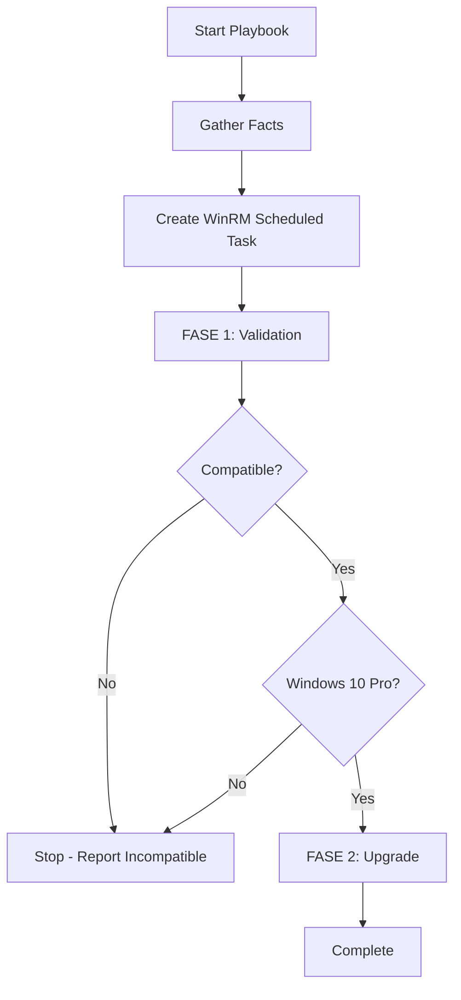

## Overview

The main playbook `migra_w10_to_w11.yml` orchestrates the complete Windows 10 to 11 migration process. It uses a two-phase approach with pre-tasks for WinRM configuration and conditional execution based on hardware compatibility.

**Source:** `~/workspace/source/migra_w10_to_w11.yml`

## Playbook Header

```yaml
- name: Migracion SO Windows 10 a 11
  hosts: all
  gather_facts: true
```

The playbook runs against all hosts defined in the inventory and automatically gathers system facts for validation.

## Pre-Tasks: WinRM Configuration

Before the main migration phases, the playbook creates a scheduled task to restore WinRM connectivity after system reboots.

```yaml
pre_tasks:
  - name: Crear Tarea Programada para recuperar Script WinRM
    community.windows.win_scheduled_task:
      name: "WinRM Setup"
      description: "Restaurar Configuración de WinRM"
      actions:
        - path: "powershell.exe"
          arguments: "-NoProfile -ExecutionPolicy Bypass -File C:/temp/ansible/PS/WinRM.ps1"
      triggers:
        - type: boot
      state: present
      enabled: true
      user: "SYSTEM"
      logon_type: service_account
```

<Note>
  This scheduled task ensures Ansible can reconnect to the Windows machine after the upgrade reboots by automatically running the WinRM configuration script on system boot.
</Note>

### WinRM Task Parameters

<ParamField path="name" type="string" default="WinRM Setup">
  Scheduled task name in Windows Task Scheduler
</ParamField>

<ParamField path="actions.path" type="string" default="powershell.exe">
  Executable that runs the WinRM configuration script
</ParamField>

<ParamField path="actions.arguments" type="string">
  PowerShell execution arguments with the WinRM script path at `C:/temp/ansible/PS/WinRM.ps1`
</ParamField>

<ParamField path="triggers.type" type="string" default="boot">
  Task trigger - runs automatically when the system boots
</ParamField>

<ParamField path="user" type="string" default="SYSTEM">
  Runs as SYSTEM account with elevated privileges
</ParamField>

## Main Task Blocks

### FASE 1: Pre-Upgrade Validation

The first phase validates system compatibility and prepares the environment.

```yaml
- name: FASE 1 - PRE-UPGRADE
  block:
    - name: 1 - Validación y Ejecución de Requisitos
      ansible.builtin.include_role:
        name: fase_1
```

This phase includes:
- Operating system validation (must be Windows 10 Pro)
- Hardware compatibility check using WhyNotWin11
- System restore point creation
- Windows updates and patches

**See:** [Compatibility Requirements](/reference/compatibility-requirements) for detailed hardware checks

### FASE 2: Windows 11 Upgrade

The second phase performs the actual upgrade, but only runs when specific conditions are met.

```yaml
- name: FASE 2 - UPGRADE
  when:
    - not compatible  # -- OJO -- Valor REAL: compatible
    - ansible_distribution == "Microsoft Windows 10 Pro"
  block:
    - name: 2 - Proceso de Upgrade
      ansible.builtin.include_role:
        name: fase_2
        tasks_from: regedit_main.yml
```

<Warning>
  The playbook uses `not compatible` in the `when` condition, but the comment indicates the real value should be `compatible`. This appears to be for testing purposes - in production, change to `compatible` to run upgrades only on compatible systems.
</Warning>

## Conditional Execution

Both upgrade-related tasks use the same conditional logic to determine execution:

| Condition | Purpose | Source |
|-----------|---------|--------|
| `not compatible` | Only proceed if system passes all 11 hardware requirements | Set in `~/workspace/source/roles/fase_1/tasks/main.yml:124-141` |
| `ansible_distribution == "Microsoft Windows 10 Pro"` | Ensure system is running Windows 10 Pro | Gathered by Ansible facts |

### Compatibility Boolean Logic

The `compatible` variable is set to `true` only when ALL hardware requirements pass:

```yaml
- name: 2.12 Validar si el PC es Compatible con Windows 11
  ansible.builtin.set_fact:
    compatible: true
  when:
    - architecture == 'True'
    - boot_method == 'True'
    - cpu_compatibility == 'True'
    - cpu_core_count == 'True'
    - cpu_frequency == 'True'
    - directx_wddm2 == 'True'
    - disk_partition_type == 'True'
    - ram_installed == 'True'
    - secure_boot == 'True'
    - storage_available == 'True'
    - tpm_version == 'True'
```

**Reference:** `~/workspace/source/roles/fase_1/tasks/main.yml:127-141`

## Execution Flow



## Role Inclusion Methods

<CodeGroup>
```yaml FASE 1
ansible.builtin.include_role:
  name: fase_1
# Uses default tasks/main.yml
```

```yaml FASE 2
ansible.builtin.include_role:
  name: fase_2
  tasks_from: regedit_main.yml
# Uses specific task file for registry-based upgrade
```
</CodeGroup>

<Info>
  FASE 2 uses `tasks_from: regedit_main.yml` to specify an alternative task file. The fase_2 role has two upgrade methods:
  - `main.yml` - ISO-based upgrade (not used by default)
  - `regedit_main.yml` - Registry-based Windows Update upgrade (default)
</Info>

## See Also

- [Roles Reference](/reference/roles) - Detailed documentation of fase_1 and fase_2 roles
- [Compatibility Requirements](/reference/compatibility-requirements) - Windows 11 hardware validation details